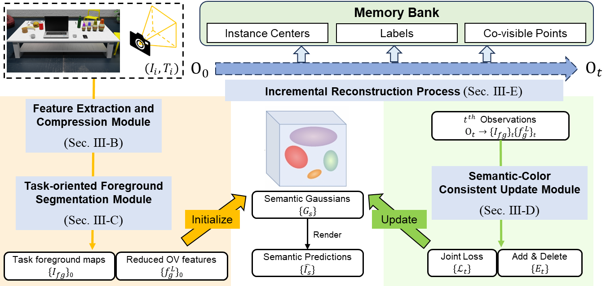

# MOVI-GS: Multi-end Open-Vocabulary Scene Reconstruction with Incremental Updates based on 3D Gaussian Splatting

  

Official implementation of **MOVI-GS**, a **M**ulti-end **O**pen-**V**ocabulary scene reconstruction system supporting **I**ncremental updates based on 3D **G**aussian **S**platting.

> **Paper**: MOVI-GS: Multi-end Open-Vocabulary Scene Reconstruction with Incremental Updates based on 3D Gaussian Splatting  
> **Authors**: 
> [[arXiv]] | [[Video (optional)]](#) | [[Project Page]](#)

---

## 🧠 Key Features

- **Open-vocabulary semantics**: Supports arbitrary text queries with CLIP-based visual-language grounding.
- **Multi-end online updates**: Designed for streaming data from multiple views or agents.
- **Incremental Gaussian scene modeling**: Efficient and flexible updates using 3D Gaussian Splatting.
- **Modular pipeline**: Compatible with different perception backbones (e.g. SAM, DINO, CLIP).
- **Real-time capable**: Supports progressive reconstruction and semantic augmentation.

---

## 🗂️ Repository Structure
Comming soon!

---

## Acknowledgement

This project is built upon the foundation of [3D Gaussian Splatting (3DGS)](https://github.com/graphdeco-inria/gaussian-splatting), and we thank the authors for their excellent work and open-source contribution.

We would also like to thank our lab colleagues and reviewers for their valuable feedback and support during the development of **MOVI-GS**.

